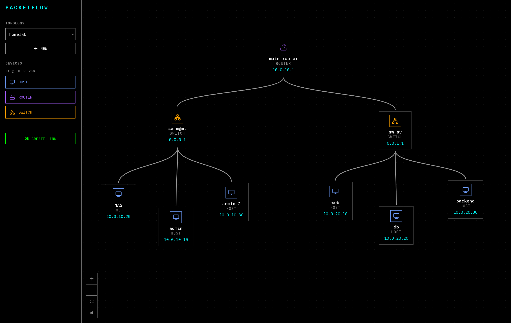

# PacketFlow

PacketFlow is a web-based network packet tracer built to make packet movement easier to understand without having to touch real hardware or a full-blown enterprise simulator

It allows to create a topology, add devices like hosts, routers, switches, and firewalls, connect them together, and simulate how packets move through the network. It is meant as a learning project, but also as a practical way to explore routing, switching, ARP, forwarding, and network behavior in a more visual way.



## Why I built this

I just wanted to represent my HomeLab topology with a pretty UI, but this project is also where I explore:
- network modeling in code
- packet forwarding logic
- ARP resolution and MAC learning
- API design for simulation workflows
- building a frontend around a systems-heavy backend

## What it does today

PacketFlow already supports the foundations of a small packet simulation platform:

- Create and load topologies
- Add and update nodes
- Create and remove interfaces
- Link devices together
- Move nodes visually on the canvas
- Create simulations
- Send packets through a topology
- Step through simulation state
- Model core network devices such as:
  - Host
  - Router
  - Switch
  - Firewall
- Persist topology and simulation-related data with PostgreSQL

## Tech stack

**Frontend**
- React
- TypeScript
- Vite
- React Flow

**Backend**
- Node.js
- TypeScript
- Express
- Prisma

**Data layer**
- PostgreSQL

**Containerization**
- Docker
- Docker Compose

## How it is structured

```text
packet-flow/
├── frontend/   # React + Vite UI for topology editing and simulation
├── backend/    # Express API, simulation logic, and models
├── db/         # Database initialization
└── docker-compose.yml
```

The backend contains the network model and simulation logic, with classes for devices and packet flow behavior. The frontend focuses on visual topology editing and user interaction.

## Core backend concepts

The backend models the network using dedicated classes for the main building blocks:

- `Node`
- `Host`
- `Router`
- `Switch`
- `Firewall`
- `NetworkInterface`
- `Link`
- `Packet`
- `Topology`
- `Simulator`

That separation is intentional. The goal is to keep the networking logic readable and extensible instead of burying everything in controllers or route handlers.

## Running locally

### Option 1 — Docker Compose

```bash
docker compose up --build
```

That starts:

- PostgreSQL
- backend API
- frontend app

Default ports:

- Frontend: `5173`
- Backend: `3000`
- PostgreSQL: `5432`

### Option 2 — Run services manually

#### Database

```bash
docker run --name packetflow-postgres \
  -e POSTGRES_USER=admin \
  -e POSTGRES_PASSWORD=admin123 \
  -e POSTGRES_DB=packetflow \
  -p 5432:5432 \
  -d postgres:16-alpine
```

#### Backend

```bash
cd backend
npm install
npm run start
```

#### Frontend

```bash
cd frontend
npm install
npm run start
```

## Current focus

Right now the project is focused on getting the simulation model and workflow into a stronger shape before expanding into more advanced network behavior.

## Roadmap

### Next

- [ ] Perfect current simulations
- [ ] Implement and document `IP.ts` / `NetworkInterface` static helpers
- [ ] Add delay and bandwidth handling to `Link.ts`
- [ ] Make `toJSON()` abstract and implement it explicitly in `Firewall`, `Host`, `Router`, and `Switch`
- [ ] Complete simulation lifecycle routes for start / stop / reset
- [ ] Expand packet management routes under simulation
- [ ] Improve container and environment documentation
- [ ] Replace placeholder package/template READMEs in subprojects with project-specific docs

## Long-term ideas

Some features I want to explore once the core is stable:

- richer packet inspection
- better simulation controls from the UI
- per-link latency and bandwidth constraints
- clearer logs and event timelines
- stronger firewall/routing visualization
- saving and replaying scenarios
- test coverage for the simulation engine

## Status

This project is actively being built and refined. The foundation is there, but there is still work to do on simulation depth, API completeness, and documentation polish.

That is part of the point of the repo: it shows both the current implementation and the direction the project is heading.

## Notes

This is not trying to be a replacement for enterprise-grade simulators. The goal is to build a smaller, understandable, developer-friendly packet tracer with a clean codebase and room to grow.

If you are into networking, systems, or simulation-heavy projects, feel free to explore the code and follow the progress.